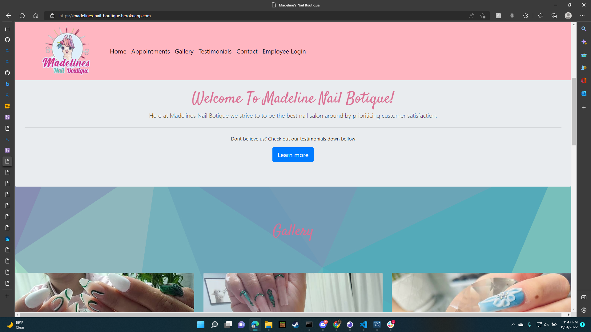
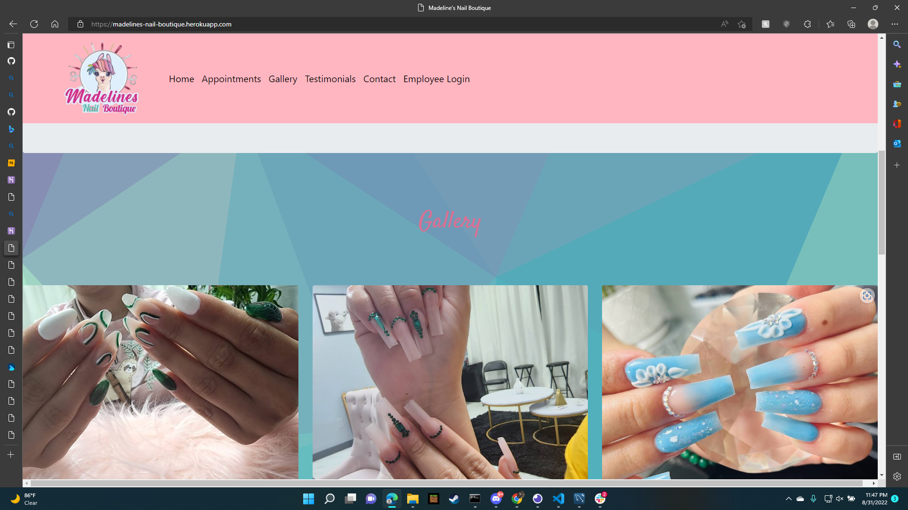
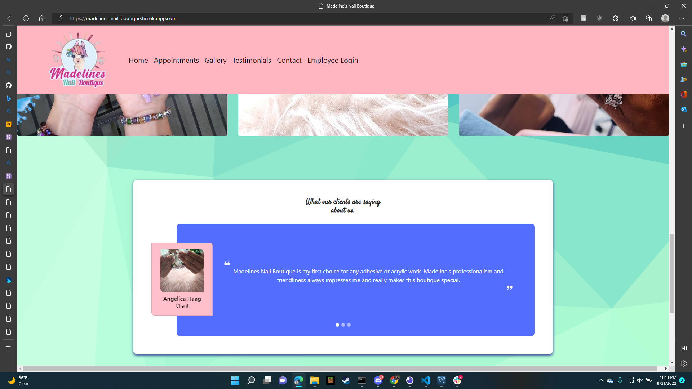
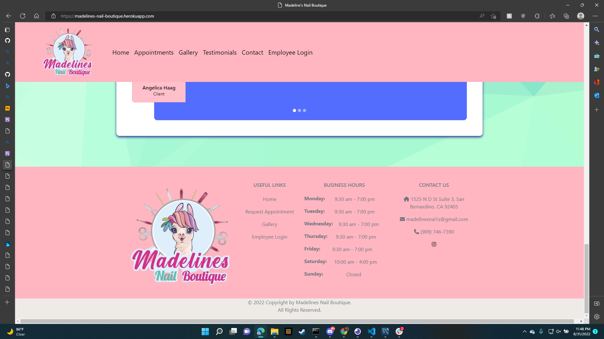
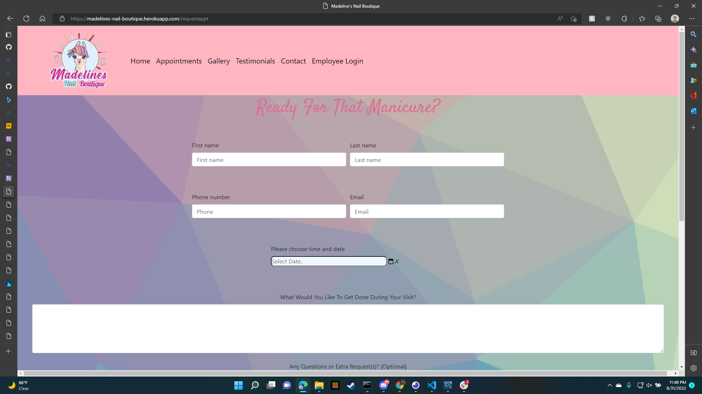
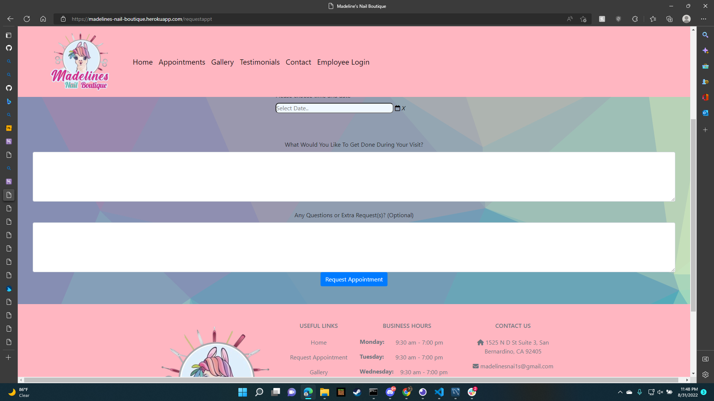
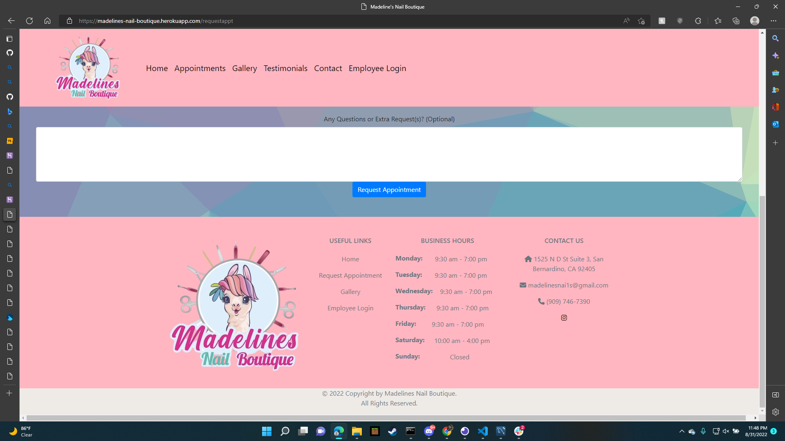

# Madelin's Nail Boutique 9/1/2022

# Contributors
CorderoCruz - Cruz Cordero Leon

SklylerF - Skyler Reece Ferreira

JMares14 - Jorge Mares

chris-one - Chris Hernandez

# Description 

Madelin's Nail Boutique is a platform we created to support a local business with a online full-stack webpage. This webpage displays a small portion of Lucero Garcia's work along with suportive comments from the customers in our examples. The main functionality of this page is to give the Boutique a place to create and display appointments.

visit us at 
 

# Example 
 

# Contact us at
github
<a href="https://github.com/CorderoCruz">CorderoCruz Github</a> 
<a href="https://github.com/SklylerF">SkylerF Github</a> 
<a href="https://github.com/JMares14">JMares14 Github</a> 
<a href="https://github.com/chris-one">Chris-One Github</a> 

# License 

